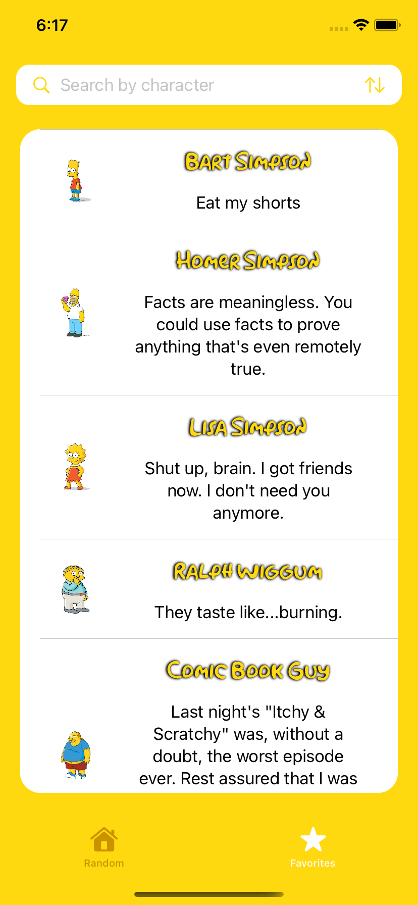
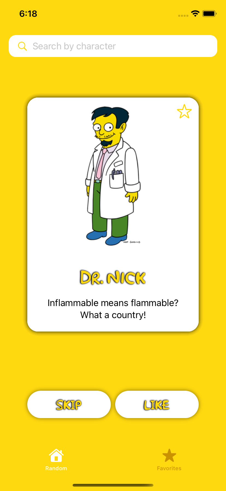

# SwiftUI-demo

SwiftUI-demo for iPhone is a project that shows iconic quotes from The Simpsons, developed in order to test my knowledge in SwiftUI.

### Installation

If you get an error when trying to build it, please go to menu bar and select File -> Swift Packages -> Reset Package Caches, and then try to build it again.

### Third party library

The project uses the library "SwiftUI CachedAsyncImage" to store in memory the images that the API provides.
https://github.com/lorenzofiamingo/swiftui-cached-async-image

### API 

The app obtains the quotes array from http://thesimpsonsquoteapi.glitch.me/ developed by Jason Luboff.

### Screenshots

 

### About

Developed by Martin Regas (ARG) - August 2022.
